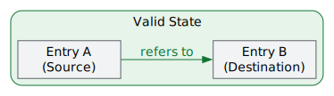
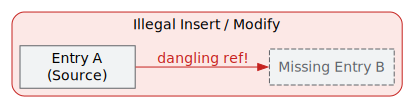
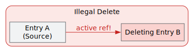
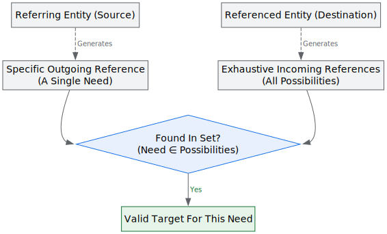
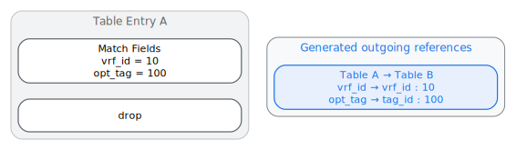
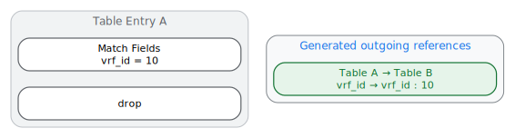
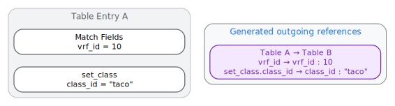
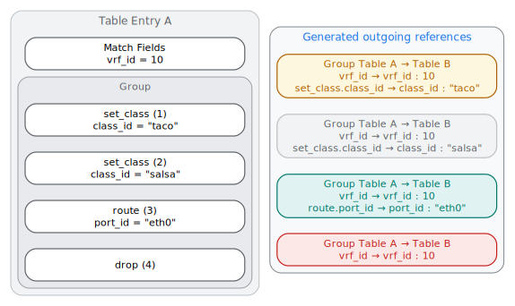
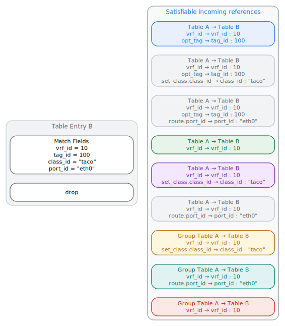
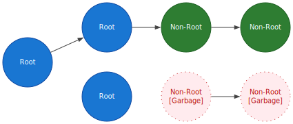

# P4 PDPI Reference Library

This document explains the design and usage of the PDPI reference library
defined in [`references.h`][ref_h] and implemented in [`references.cc`][ref_cc].

## Overview

The P4 PDPI references library provides utilities to validate reference
constraints between different P4 entities (e.g., table entries, multicast
groups).

In a P4 pipeline, entries in one table may refer to entries in another table.
For example, a table entry might reference a VLAN ID in a VLAN table:

<p align="center">
  
</p>

The library checks for **dangling references** to ensure that entries never
point to missing resources. Specifically, it enforces two safety properties:

**1. Safe Inserts / Modifies (Outgoing References):** If entry A refers to entry
B, entry B must exist before entry A can be inserted or created through
modification.

<p align="center">
  
</p>

**2. Safe Deletes (Incoming References):** Entry B cannot be deleted if entry A
is still referring to it.

<p align="center">
  
</p>

WARNING: This library is known to have poor performance. It relies heavily on
copy-heavy operations and set operations. Use with caution in
performance-critical paths.

## Core Concepts & Representation

### P4 annotations & IR Schema

P4 programs model reference constraints using annotations like `@refers_to` and
`@referenced_by` on match fields or action parameters.

For example, this P4 snippet shows a `@refers_to` annotation on an action
parameter (where parameter `vlan_id` in action `set_vlan` refers to the
`vlan_id` match field in `vlan_table`):

```p4
action set_vlan(@id(1) @refers_to(vlan_table, vlan_id)
                   vlan_id_t vlan_id) {
  // ...
}
```

Similarly, this snippet shows a `@referenced_by` annotation on a match field
(where match field `port_id` in `interface_table` is referenced by
`replica.port` in the built-in multicast group table):

```p4
table interface_table {
  key = {
    port_id : exact
      @referenced_by(builtin::multicast_group_table, replica.port) @id(1);
  }
  // ...
}
```

> [!NOTE] `@referenced_by` **MUST** only be used for `builtin` entities,
> otherwise the p4 model will be rejected. Built-in entities are not present in
> the P4 model and therefore cannot have a `@refers_to` annotation attached to
> them. The `@refers_to` annotation **MUST** be used for all other use cases.

During the creation of [`IrP4Info`][ir_p4info] (Intermediate Representation of
P4Info), these annotations are used to generate reference information,
[`IrTableReference`][ir_table_ref], that is stored inside
[`IrTableDefinition`][ir_table_def] messages.

```proto
message IrTableDefinition {
  // ...
  repeated IrTableReference outgoing_references = 15;
  repeated IrTableReference incoming_references = 16;
}

message IrTableReference {
  IrTable source_table = 1;       // e.g., Table A
  IrTable destination_table = 2;  // e.g., Table B
  repeated FieldReference field_references = 3;
  message FieldReference {
    IrField source = 1;       // e.g., Field X1 (or X2)
    IrField destination = 2;  // e.g., Field Y1 (or Y2)
  }
}
```

### Reference Rules

References (defined by [`FieldReferenceType`][ref_type]) are only between:

1.  Match Field → Match Field ([`kMatchFieldToMatchField`][m2m])
2.  Action Parameter → Match Field ([`kActionParamToMatchField`][a2m])

**Targets CANNOT be action parameters.** This is because in tables using dynamic
action selectors or profile groups (e.g., WCMP), the hardware picks an action at
runtime per packet. The validation library cannot know upfront which action
parameter will be chosen and thus if the entry is a valid reference for tables
earlier in the pipeline.

> [!NOTE] Targets also **CANNOT be optional match fields**. This feature is
> currently omitted because we have no concrete networking use case.

### Abstract vs. Concrete References

While [`IrP4Info`][ir_p4info] defines references abstractly at compile time
(e.g., "Table A, Field X refers to Table B, Field Y"), the validation library
must work with **concrete references** containing actual runtime table entry
values (e.g., "Table A, Entry with X=10 refers to Table B, Entry with Y=10").

The C++ library represents concrete references using two structs
([`ConcreteTableReference`][ct_ref] and [`ConcreteFieldReference`][cf_ref]):

```cpp
// Represents a runtime reference between two tables across a set of fields.
struct ConcreteTableReference {
  std::string source_table;       // Referring table name (e.g., Table A)
  std::string destination_table;  // Referred table name (e.g., Table B)
  absl::btree_set<ConcreteFieldReference> fields;  // Matching field references
};

// Represents a single field-to-field reference, pairing a source field name
// with a destination field name and its exact runtime byte value.
struct ConcreteFieldReference {
  std::string source_field;       // Referring field (e.g., Field X1)
  std::string destination_field;  // Referred field (e.g., Field Y1)
  std::string value;              // e.g. "10" (written as P4Runtime bytes)
};
```

### Reference Matching Mechanics

An entity acts as a source and/or a destination:

-   **Outgoing References (source):** References that an entity *needs*.
-   **Incoming References (destination):** References that an entity *can
    satisfy*.

Because a referenced entity (the destination) cannot make any assumptions about
the referring entry (the source) (e.g. whether an optional field is present or
what action is being used) it must generate an exhaustive set of all possible
references it can satisfy. The destination is considered a valid target for a
specific outgoing reference from the source if that need is found within the
destination`s exhaustive set.

> [!NOTE] A source is only fully satisfied if **all** of its outgoing references
> are satisfied, potentially requiring multiple different destinations.

When Entry A in a [`source_table`][src_table] needs an outgoing reference
satisfiable by Entry B in a [`destination_table`][dst_table], Entry A depends on
Entry B.

<p align="center">
  
</p>

## Runtime Concrete Reference Construction

The validation library extracts concrete runtime byte values from Protobuf
entities to build concrete outgoing and incoming reference sets.

Suppose the compile-time schema defines two sets of
[`IrTableReference`][ir_table_ref] info pointing to `Table B` (one from a normal
table and one from a WCMP group table):

```textproto
# 1. Normal referring table (includes reference from an optional match field):
table_references {
  source_table: "Table A"
  destination_table: "Table B"

  # For readability, fields are represented using just their names with action
  # parameters prefixed with their parent action; in reality, fields are
  # nested proto messages with type info.

  # Match Field vrf_id refers to Match Field vrf_id:
  field_references { source: "vrf_id", destination: "vrf_id" }

  # Optional Match Field opt_tag refers to Match Field tag_id:
  field_references { source: "opt_tag", destination: "tag_id" }

  # Action Param class_id in set_class refers to Match Field class_id:
  field_references { source: "set_class.class_id", destination: "class_id" }

  # Action Param port_id in route refers to Match Field port_id:
  field_references { source: "route.port_id", destination: "port_id" }
}

# 2. WCMP Group referring table:
table_references {
  source_table: "Group Table A"
  destination_table: "Table B"

  # Match Field vrf_id refers to Match Field vrf_id:
  field_references { source: "vrf_id", destination: "vrf_id" }

  # Action Param class_id in set_class refers to Match Field class_id:
  field_references { source: "set_class.class_id", destination: "class_id" }

  # Action Param port_id in route refers to Match Field port_id:
  field_references { source: "route.port_id", destination: "port_id" }
}
```

### Constructing Outgoing References

An entity's outgoing reference constraints come from both its match fields
(excluding omiited optional fields) and its actions (which are present only when
the entity executes that action).

Here are four examples of how the library builds
[`ConcreteTableReference`][ct_ref] objects:

**1. Optional Source Field Present:**

<p align="center">
  
</p>

**2. Optional Source Field Omitted:**

<p align="center">
  
</p>

**3. Action Parameter Reference Present:**

<p align="center">
  
</p>

**4. Action Sets (WCMP Groups):**

<p align="center">
  
</p>

> [!NOTE] For an insert or modify operation to be valid, **ALL** outgoing
> references generated by an action set must be successfully satisfied.

### Generating Incoming References

Destination entities (such as `Table Entry B`) generate satisfiable incoming
reference keys for all possible references that could point to them ( **matched
with the outgoing references above by color**, except for gray which means
unmatched):

<p align="center">
  
</p>

> [!NOTE] A single destination entry can satisfy multiple source entries
> simultaneously (for example, the entry in `Table B` satisfies entries 1, 2,
> and 3 above as the color coding shows). It cannot fully satisfy entry 4, as
> that entry requires a satisfying reference where `class_id = "salsa"`.

## Reference Validation APIs

The library provides two ways to validate table dependencies: stateful
validation, which tracks active dependencies across incremental updates, and
stateless batch validation, which checks an entire list of entries at once.

### Stateful Validation

[`StatefulReferenceChecker`][checker] validates table updates incrementally:

```cpp
class StatefulReferenceChecker {
 public:
  explicit StatefulReferenceChecker(IrP4Info info);

  absl::Status AddEntity(const ::p4::v1::Entity& entity);
  absl::Status RemoveEntity(const ::p4::v1::Entity& entity);
  absl::Status UpdateEntity(const ::p4::v1::Entity& entity);
};
```

#### Internal State Maps

To verify updates instantly without re-scanning the entire forwarding state, the
checker caches:

-   [`concrete_reference_to_state_`][ref2state]: Maps a
    [`ConcreteTableReference`][ct_ref] directly to its active counts:

    ```cpp
    struct ReferenceState {
      int referrer_count = 0;   // Active entries requiring this reference.
      int satisfying_count = 0; // Active entries satisfying this reference.
    };
    ```

-   [`entity_key_to_outgoing_references_`][key2out]: Caches an entry's outgoing
    needs against its [`EntityKey`][entity_key]. This allows delete and update
    operations to decrement old dependency counts instantly without re-parsing
    protobuf entities.

#### Operations

-   **[`AddEntity`][add_ent]**: Validates and indexes a newly inserted entry:
    1.  **Verify Dependencies:** Computes outgoing references and asserts that
        all required references exist. **If verification fails**, operation is
        rejected, state is unchanged, and error is returned.
    2.  **Index Satisfiable Keys:** Indexes incoming reference keys that this
        entry can satisfy.
    3.  **Increment Counts:** Increments [`referrer_count`][ref_cnt] for its
        outgoing needs and [`satisfying_count`][sat_cnt] for its incoming keys.
-   **[`RemoveEntity`][rem_ent]**: Removes an entry while preventing dangling
    pointers:
    1.  **Verify Dependencies:** Computes incoming keys and asserts that
        removing them will not leave active referrers dangling. **If
        verification fails**, operation is rejected, state is unchanged, and
        error is returned.
    2.  **Decrement Counts:** Decrements reference counts, erasing depleted
        state structs when [`satisfying_count`][sat_cnt] reaches 0.
-   **[`UpdateEntity`][upd_ent]**: Modifies an entry's non-key parameters:
    1.  **Verify New Dependencies:** Computes new outgoing references and
        asserts that all required references exist. **If verification fails**,
        operation is rejected, state is unchanged, and error is returned.
    2.  **Reconcile Dependency Counts:** Decrements [`referrer_count`][ref_cnt]
        for old outgoing dependencies and increments for new ones.
    3.  *Note on Stable Keys:* Incoming references never change during an update
        because an entry's match fields ([`EntityKey`][entity_key]) stay exactly
        the same and actions can never be targets.

### Stateless Batch Validation

Stateless batch validation checks an entire list of table entries at once.

#### UnsatisfiedOutgoingReferences

```cpp
absl::StatusOr<std::vector<EntityWithUnsatisfiedReferences>>
UnsatisfiedOutgoingReferences(const std::vector<::p4::v1::Entity>& pi_entities,
                              const pdpi::IrP4Info& info);
```

This function checks references across a vector of entities:

1.  **Index Satisfiable Keys:** Collects all incoming reference keys that can be
    satisfied by the entries in the list.
2.  **Extract Dependencies:** Collects all outgoing references required by the
    entries in the list.
3.  **Flag Missing Targets:** Returns any outgoing reference that lacks a
    matching satisfiable reference.

## Use-cases

### Garbage Collection (GC)

In hardware switches, table space is a limited resource. Entries that are no
longer referenced by any routing or ACL entries waste hardware resources.
Garbage Collections (GC) is the process of identifying and removing these unused
entries.

#### Roots vs. Non-Roots

To implement GC, the user provides a rule to classify entries as either roots or
non-roots:

-   **Roots:** Entries that are considered active independently of whether other
    entries reference them (e.g., Ingress ACLs, IPv4 Routing entries).
-   **Non-Roots:** Entries that are only considered active if they are
    referenced by active entries (e.g., NextHop entries, Tunnel entries, Router
    Interface entries).

An entry in a non-root table is considered **garbage** if it is unreachable from
any active root entry.

<p align="center">
  
</p>

#### Stateless Garbage Collection

[`GetEntitiesUnreachableFromRoots`][get_unreach] (defined in
[`sequencing.h`][seq_h]) finds ALL unreachable entries across a list at once:

```cpp
absl::StatusOr<std::vector<p4::v1::Entity>> GetEntitiesUnreachableFromRoots(
    absl::Span<const p4::v1::Entity> entities,
    absl::FunctionRef<absl::StatusOr<bool>(const p4::v1::Entity&)>
        is_root_entity,
    const IrP4Info& ir_p4info);
```

The function performs a Breadth-First Search (BFS) starting from root entries:

1.  **Identify Roots:** Uses the provided `is_root_entity` rule to classify all
    input `entities` as either roots or non-roots.
    *   **Roots** are pushed onto a BFS traversal queue (frontier).
    *   **Non-Roots** are stored in a map of potentially reachable entries,
        keyed by the concrete references they can satisfy (using
        [`PossibleIncomingConcreteTableReferences`][incoming_refs]).
2.  **Reachability Traversal (BFS):**
    *   Pops an entry from the frontier.
    *   Retrieves all outgoing references for this entry using
        [`GetOutgoingTableReferences`][get_out_refs].
    *   For each reference, checks if it matches any non-root entry in the map.
    *   If a match is found, that non-root entry is marked as reachable and
        moved to the frontier queue to resolve its own transitive needs.
3.  **Return Unreachable Entries:**
    *   Once the BFS queue is empty, any non-root entries remaining in the map
        are unreachable from any root.
    *   Returns these unreachable entries so the caller can delete them.

[ref_h]: https://github.com/google/p4-infra/blob/main/p4_pdpi/references.h
[ref_cc]: https://github.com/google/p4-infra/blob/main/p4_pdpi/references.cc
[ir_p4info]: https://github.com/search?q=repo:google/p4-infra+symbol:IrP4Info&type=code
[cf_ref]: https://github.com/search?q=repo:google/p4-infra+symbol:ConcreteFieldReference&type=code
[ct_ref]: https://github.com/search?q=repo:google/p4-infra+symbol:ConcreteTableReference&type=code
[src_table]: https://github.com/search?q=repo:google/p4-infra+symbol:source_table&type=code
[dst_table]: https://github.com/search?q=repo:google/p4-infra+symbol:destination_table&type=code
[ref_type]: https://github.com/search?q=repo:google/p4-infra+symbol:FieldReferenceType&type=code
[m2m]: https://github.com/search?q=repo:google/p4-infra+symbol:kMatchFieldToMatchField&type=code
[a2m]: https://github.com/search?q=repo:google/p4-infra+symbol:kActionParamToMatchField&type=code
[entity_key]: https://github.com/search?q=repo:google/p4-infra+symbol:EntityKey&type=code
[checker]: https://github.com/search?q=repo:google/p4-infra+symbol:StatefulReferenceChecker&type=code
[ref2state]: https://github.com/search?q=repo:google/p4-infra+symbol:concrete_reference_to_state_&type=code
[key2out]: https://github.com/search?q=repo:google/p4-infra+symbol:entity_key_to_outgoing_references_&type=code
[add_ent]: https://github.com/search?q=repo:google/p4-infra+symbol:AddEntity&type=code
[sat_cnt]: https://github.com/search?q=repo:google/p4-infra+symbol:satisfying_count&type=code
[rem_ent]: https://github.com/search?q=repo:google/p4-infra+symbol:RemoveEntity&type=code
[ref_cnt]: https://github.com/search?q=repo:google/p4-infra+symbol:referrer_count&type=code
[upd_ent]: https://github.com/search?q=repo:google/p4-infra+symbol:UpdateEntity&type=code
[incoming_refs]: https://github.com/search?q=repo:google/p4-infra+symbol:PossibleIncomingConcreteTableReferences&type=code
[get_unreach]: https://github.com/search?q=repo:google/p4-infra+symbol:GetEntitiesUnreachableFromRoots&type=code
[seq_h]: https://github.com/google/p4-infra/blob/main/p4_pdpi/sequencing.h
[get_out_refs]: https://github.com/search?q=repo:google/p4-infra+symbol:GetOutgoingTableReferences&type=code
[ir_table_def]: https://github.com/search?q=repo:google/p4-infra+symbol:IrTableDefinition&type=code
[ir_table_ref]: https://github.com/search?q=repo:google/p4-infra+symbol:IrTableReference&type=code
